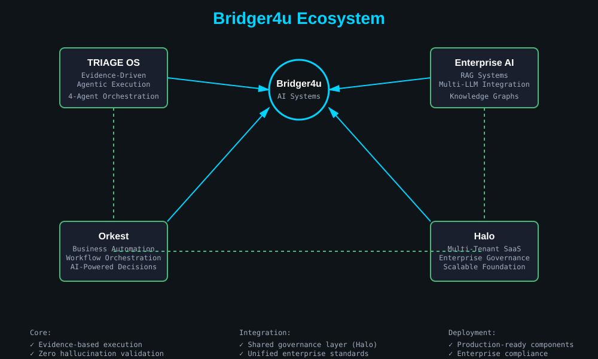
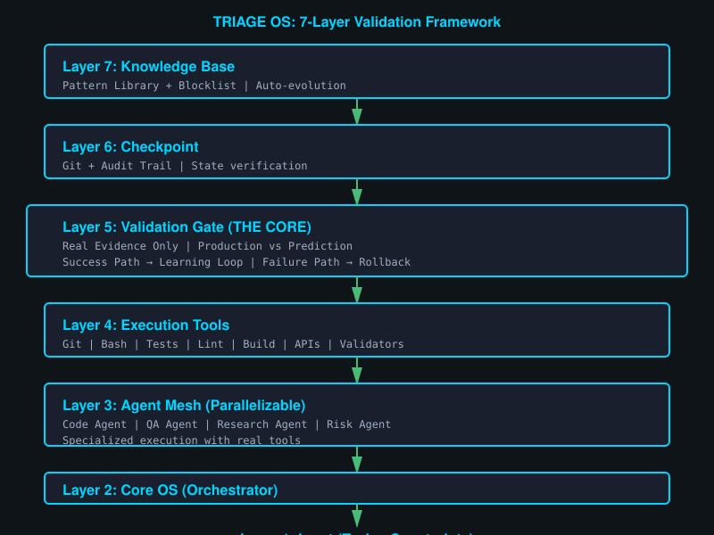

# Fernando Sosnik

> **Founder & Technology Director @ Bridger4u**  
> Building Enterprise AI Systems, Agentic Workflows, and Business Automation Platforms

---

## What I Do

I architect and build **enterprise-grade AI systems** that solve real business problems:

- **Agentic Systems**: Multi-agent orchestration frameworks (TRIAGE OS)
- **Workflow Automation**: Business process automation with AI (Orkest)
- **Enterprise AI**: RAG, multi-LLM, knowledge graphs (Enterprise AI Portfolio)
- **Multi-Tenant Platforms**: Scalable SaaS foundations (Halo)
- **Property Management**: Premium web applications for rental administration (SansaHnas)

**All with evidence-based validation, real metrics, zero hallucination.**

---

## Bridger4u Ecosystem

**Core Products:**
- **TRIAGE OS** — Evidence-Driven Agentic Execution
- **Enterprise AI Portfolio** — Production RAG & Multi-LLM Patterns  
- **Orkest** — AI-Powered Business Operating Platform
- **Halo** — Multi-Tenant SaaS Foundation

---

## Core Products

### TRIAGE OS — Evidence-Driven Agent Orchestration
- 4-agent specialization (Code, QA, Research, Risk)
- Real validation (Git, tests, production)
- 71.5x token savings (Graphify + Ruflo)
- Status: Prototype → Real Execution
- [fsosnik/triage](https://github.com/fsosnik/triage)

### Orkest — Business Automation Platform
- Workflow automation with AI
- Multi-tenant, event-driven architecture
- LLM-powered intelligent decision making
- Status: In development
- [fsosnik/orkest](https://github.com/fsosnik/orkest)

### Enterprise AI Portfolio
- Production-ready LLM patterns
- RAG implementations with knowledge graphs
- Multi-provider support (Claude, GPT, Gemini, Ollama)
- Status: Reference implementation
- [fsosnik/enterprise-ai-llm-portfolio](https://github.com/fsosnik/enterprise-ai-llm-portfolio)

### Halo — Multi-Tenant Foundation
- Scalable SaaS architecture
- Enterprise-grade tenant isolation
- Governance and compliance frameworks
- Status: Core framework
- [fsosnik/halo](https://github.com/fsosnik/halo)

---

## Additional Projects

### SansaHnas — Property & Tenant Management System
Premium web application for managing rentals, properties, income, expenses, and tenant records.

**Tech Stack**: React + TypeScript + Vite (frontend), PHP API + MySQL (backend)

**Features**:
- Mathematical expression support in transaction amounts
- Light/Dark mode with persistent user preferences
- Secure session tokens with HMAC validation
- Production deployment via automated scripts

**Status**: Production  
**Live**: [https://www.sosnik.com.ar/SansaHnas](https://www.sosnik.com.ar/SansaHnas)  
**Repository**: [fsosnik/sansahnas](https://github.com/fsosnik/sansahnas)

---

## Specializations

**AI Architecture**: Agentic Workflows, Knowledge Graphs, RAG Systems, LLM Integration, Token Optimization

**Enterprise Systems**: Multi-Tenancy, Governance, Compliance, Security, Scalability

**Business Automation**: Process Mining, Decision Automation, Workflow Orchestration, Property Management, KPI Optimization

---

## Key Metrics

- **225+ tests passing** (TRIAGE OS)
- **840-node knowledge graph** (Graphify integration)
- **71.5x token optimization** (vs raw context)
- **2.4x execution speedup** (parallel agents)
- **4-agent orchestration** (zero hallucination validation)
- **7 case studies** with real enterprise results

---

## Connect

- **Personal**: [sosnik.com.ar](https://sosnik.com.ar)
- **Company**: [bridger4u.com](https://bridger4u.com)
- **LinkedIn**: [@fsosnik](https://linkedin.com/in/fsosnik)
- **Email**: [fersosnik@gmail.com](mailto:fersosnik@gmail.com)

---

## TRIAGE OS: 7-Layer Validation Framework

### Key Principle

> If code contradicts documentation, code wins.  
> If prediction contradicts production evidence, evidence wins.  
> No hallucinations, no narratives.

---

## Open to

- **Partnerships**: AI-driven automation in enterprise
- **Consulting**: Architecture & implementation guidance
- **Advisory**: AI governance & enterprise frameworks
- **Clients**: Custom agentic systems & workflow automation

---

## See Also

- [Case Studies](./CASE_STUDIES.md) — Real problems, real solutions, real results
- [Bridger4u Hub](https://github.com/fsosnik/bridger4u.com) — Company overview

---

**Built with honesty, evidence, and enterprise-grade standards.**

*Last updated: June 5, 2026*
